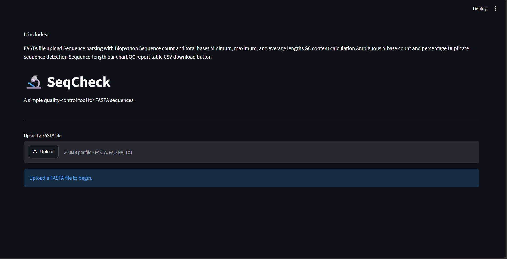
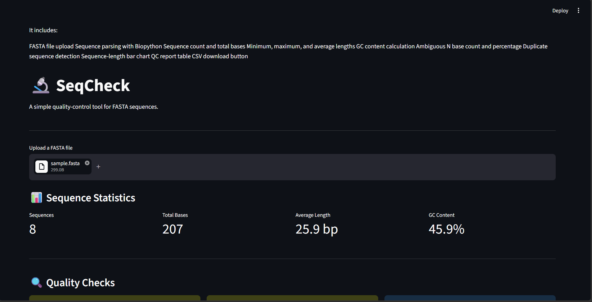
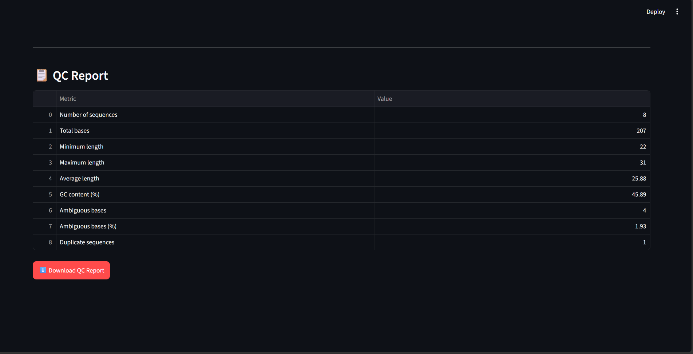
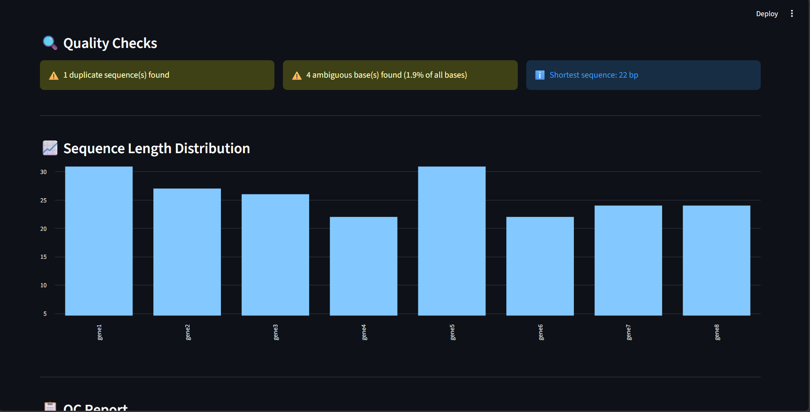

# 🔬 SeqCheck

> **A lightweight FASTA quality-control tool for quickly inspecting sequence datasets and identifying common sequence issues.**

SeqCheck is a simple, beginner-friendly bioinformatics web application designed to perform an initial quality check of FASTA files. It provides essential sequence statistics, identifies potential data-quality issues, visualizes sequence-length distributions, and generates a downloadable CSV report.

The project is built using **Python, Biopython, Pandas, Matplotlib, and Streamlit**.

---

## 📌 Overview

FASTA files are widely used to store DNA, RNA, and protein sequences. Before using a sequence dataset for downstream bioinformatics analysis, it is useful to inspect its basic properties and identify possible issues.

SeqCheck provides a simple interface for performing these initial checks without requiring users to manually calculate statistics or use command-line tools.

The application analyzes uploaded FASTA files and provides information including:

- Number of sequences
- Total sequence length
- Minimum sequence length
- Maximum sequence length
- Average sequence length
- GC content
- Number of ambiguous bases
- Duplicate sequences
- Sequence-length distribution

---

## ✨ Features

### Sequence Statistics

- 📂 Upload FASTA files
- 🔢 Count the total number of sequences
- 📏 Calculate total sequence length
- 📊 Calculate minimum, maximum, and average sequence length
- 🧬 Calculate GC content

### Quality Checks

- ⚠️ Detect ambiguous bases (`N`)
- 🔍 Identify duplicate sequences
- 📋 Provide a concise summary of sequence-level information

### Visualization & Reporting

- 📈 Visualize sequence-length distribution
- 📄 Generate a downloadable CSV quality-control report

---

## 🖥️ Screenshots

### 🏠 Home Page

The SeqCheck interface allows users to upload a FASTA file and begin the quality-control analysis.



---

### 📊 QC Summary

The application displays essential sequence statistics, including sequence count, total length, average length, and GC content.



---

### 🔍 Sequence Quality Checks

SeqCheck identifies duplicate sequences and ambiguous bases to help users detect potential issues within their dataset.



---

### 📈 Sequence Length Distribution

The tool provides a visual representation of sequence-length distribution for quick inspection of the dataset.



---

## 🛠️ Technology Stack

| Technology | Purpose |
|---|---|
| **Python** | Core application development |
| **Biopython** | FASTA parsing and sequence processing |
| **Pandas** | Data handling and CSV report generation |
| **Matplotlib** | Sequence-length visualization |
| **Streamlit** | Interactive web interface |

---

## 📁 Project Structure

```text
SeqCheck/
│
├── app.py
├── README.md
├── requirements.txt
├── LICENSE
├── .gitignore
│
├── sample_data/
│   └── sample.fasta
│
└── screenshots/
    ├── home.png
    ├── result_1.png
    ├── result_2.png
    └── result_3.png
```
---

### ⚙️ Installation

## 1. Clone the repository
git clone https://github.com/Manishha07/SeqCheck.git

## 2. Navigate to the project directory
cd SeqCheck

## 3. Install the required dependencies
pip install -r requirements.txt

---

### ▶️ Run the Application
Start the Streamlit application using:
> streamlit run app.py
The application will open in your default web browser.

---

### 🧪 Example Workflow
A typical SeqCheck workflow is:

Launch the application.
Upload a FASTA file.
View the number of sequences and basic sequence statistics.
Check GC content and ambiguous bases.
Identify duplicate sequences.
Examine the sequence-length distribution.
Download the quality-control results as a CSV file.

---

### 📄 Sample Data
A sample FASTA file is included in the sample_data directory for testing.
> cd sample_data/sample.fasta
The sample dataset allows users to explore the application without needing to provide their own FASTA file.

---

### 🔬 Example Output
Depending on the uploaded dataset, SeqCheck provides information such as:

Number of sequences     8
Total bases             200+
Minimum length          XX bp
Maximum length          XX bp
Average length          XX bp
GC content              XX.X %
Ambiguous bases         X
Duplicate sequences     X

The values shown above are illustrative and will vary depending on the uploaded FASTA dataset.

---

### 🎯 Intended Use
SeqCheck is intended for:

Students learning bioinformatics
Beginners working with FASTA files
Researchers performing preliminary sequence inspection
Quick quality-control checks before downstream analysis
Learning and demonstrating basic biological data processing

Note: SeqCheck is designed as a basic first-pass FASTA quality-control tool. It is not intended to replace specialized sequence-quality assessment tools or complete downstream bioinformatics pipelines.

---

### 🚀 Future Improvements
Potential future enhancements include:

 DNA/RNA/Protein sequence-type detection
 GC-content distribution
 More detailed quality-control scoring
 FASTQ file support
 Additional sequence-quality metrics
 Improved data visualizations
 Detailed sequence-level QC reports
 Interactive filtering of sequences

 ---

 ### 📚 Skills Demonstrated
This project demonstrates practical experience with:

Python programming
FASTA file processing
Biopython
Basic sequence analysis
Data cleaning and quality control
Pandas
Data visualization
Streamlit application development
CSV report generation
Git and GitHub

---

### 👩‍💻 Author
Manisha R.

Integrated Master's Student
Systems and Computational Biology

Areas of interest:

Bioinformatics
Computational Biology
Artificial Intelligence
Scientific Software Development

---

### 📜 License
This project is licensed under the MIT License.
See the LICENSE file for details.

---

### ⭐ Acknowledgements
SeqCheck is built using the following open-source Python libraries:

Biopython
Streamlit
Pandas
Matplotlib

---

### ⭐ Support
If you find this project useful for learning or preliminary FASTA quality control, consider giving the repository a ⭐ on GitHub.

---
